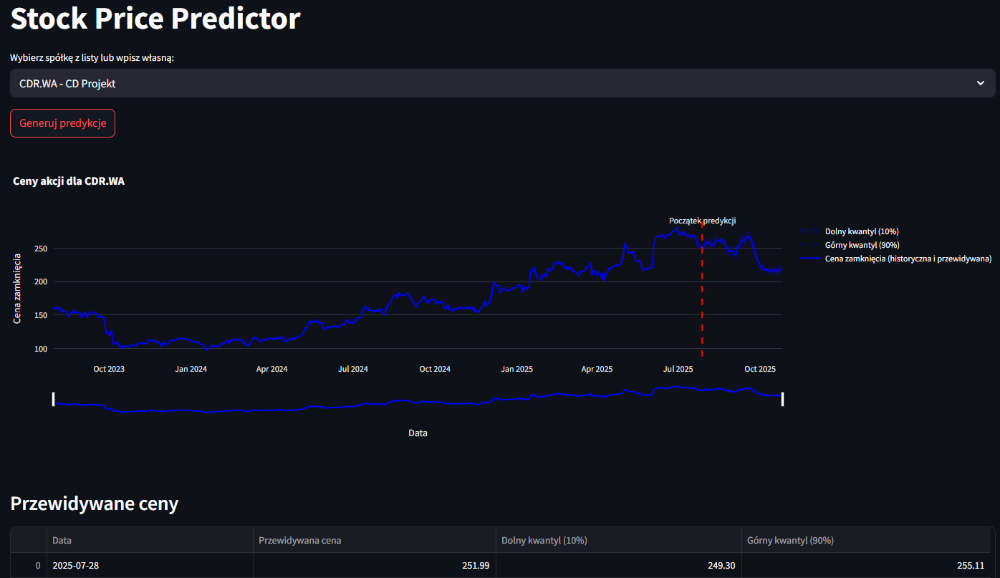
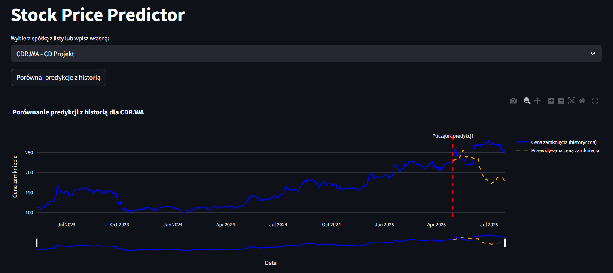
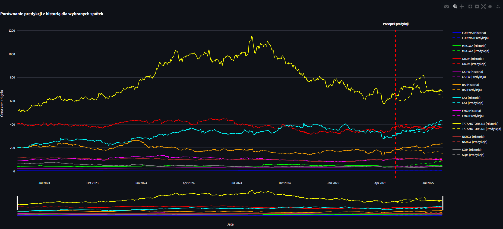
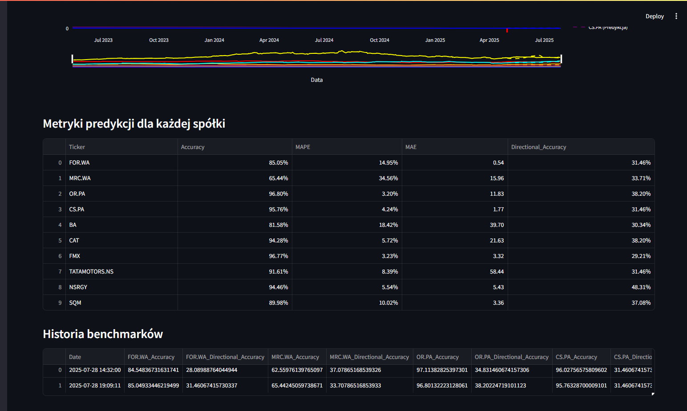

# 📈 Model Predykcyjny Kursu Akcji

Ten projekt implementuje model predykcyjny kursu akcji oparty na danych giełdowych, wykorzystujący Temporal Fusion Transformer (TFT). Zawiera również aplikację webową zbudowaną w Streamlit, która umożliwia wizualizację prognoz, porównanie predykcji z danymi historycznymi oraz ocenę skuteczności modelu poprzez benchmark.

---

## 🚀 Funkcjonalności

- **Trening modelu**: Skrypt `start_training.py` pozwala na pobranie danych giełdowych, trening modelu i zapis wyników.
- **Predykcje przyszłości**: Aplikacja Streamlit generuje prognozy cen akcji dla wybranych tickerów (np. `CDR.WA`).
- **Porównanie z historią**: Możliwość porównania predykcji z rzeczywistymi danymi historycznymi.
- **Benchmark**: Ocena skuteczności modelu na zestawie tickerów z metrykami takimi jak Dokładność i Dokładność kierunkowa.

---

## 🖥️ Uruchomienie projektu

### Trening modelu
Aby rozpocząć trening modelu, uruchom:
```bash
python start_training.py
```
Skrypt pobiera dane giełdowe (za pomocą `yfinance`), trenuje model TFT i zapisuje wyniki w folderze `models`.

### Aplikacja webowa
Aby uruchomić aplikację Streamlit:
```bash
streamlit run app/app.py
```
Aplikacja umożliwia:
- Generowanie predykcji dla wybranego tickera.
- Porównanie predykcji z danymi historycznymi.
- Wyświetlenie wyników benchmarku dla zestawu tickerów.

---

## 📊 Przykłady wyników

### Predykcje dla `CDR.WA`
Poniżej przedstawiono przykład predykcji cen zamknięcia dla tickera `CDR.WA` na kolejne dni, z kwantylami 10% i 90%.



### Porównanie predykcji z historią dla `CDR.WA`
Wykres porównuje przewidywane ceny zamknięcia z rzeczywistymi danymi historycznymi dla `CDR.WA`.



### Benchmark
#### Wykres benchmarku
Wykres porównuje predykcje z danymi historycznymi dla tickerów zdefiniowanych w pliku `config/benchmark_tickers.yaml` (unikalne tickery, różne od tych użytych w treningu).



#### Tabela metryk benchmarku
Tabela przedstawia metryki skuteczności modelu dla tickerów w benchmarku, takie jak Accuracy, MAPE, MAE i Directional Accuracy.



---

## ⚠️ Ograniczenia danych

Biblioteka `yfinance` używana do pobierania danych giełdowych nie dostarcza **historycznych** wartości wskaźników fundamentalnych, takich jak:
- **PE ratio** (Price to Earnings)
- **PB ratio** (Price to Book)

Dostępne są jedynie **aktualne wartości** tych wskaźników poprzez metodę `Ticker().info`.

---

## 📁 Struktura projektu

```
├── app/
│   ├── app.py              # Aplikacja Streamlit
│   ├── benchmark_utils.py  # Funkcje do generowania benchmarku
│   ├── config_loader.py    # Wczytywanie konfiguracji i tickerów
│   ├── plot_utils.py       # Funkcje do tworzenia wykresów
├── scripts/
│   ├── config_manager.py   # Zarządzanie konfiguracją
│   ├── data_fetcher.py     # Pobieranie danych giełdowych
│   ├── feature_importance.py # Analiza ważności cech
│   ├── model.py            # Definicja modelu
│   ├── prediction_engine.py # Logika predykcji
│   ├── preprocessor.py     # Przetwarzanie danych
│   ├── train.py            # Trening modelu
├── config/
│   ├── config.yaml         # Plik konfiguracyjny
│   ├── tickers.yaml        # Lista tickerów
│   ├── benchmark_tickers.yaml # Tickery do benchmarku
│   ├── company_names.yaml  # Nazwy spółek
├── data/                   # Dane surowe i przetworzone
├── models/                 # Zapisane modele
├── start_training.py       # Skrypt do treningu modelu
├── README.md               # Dokumentacja projektu
├── requirements.txt        # Lista zależności
```

---

## 🛠️ Wymagania

Projekt wymaga Pythona 3.9+ oraz zależności wymienionych w pliku `requirements.txt`. Aby zainstalować zależności, wykonaj:
```bash
pip install -r requirements.txt
```

> **Uwaga**: Pełna lista bibliotek (np. `streamlit`, `yfinance`, `pytorch`, `pandas`) znajduje się w `requirements.txt`. Upewnij się, że środowisko wirtualne jest aktywne przed instalacją.

---

## 📚 Modele

Porównanie modeli:

| Model       | Opis                              | Dokładność | Dokładność kierunkowa | Długość predykcji | Czy działa | Szybkość treningu |
|-------------|-----------------------------------|------------|-----------------------|-------------------|------------|-------------------|
| **gen3**    | Pierwszy użyteczny model          | 88.9%      | -                     | 90 dni            | Nie        | 60 min/epoka      |
| **gen3mini**| Lżejsza wersja do szybkich testów | 87.8%      | -                     | 90 dni            | Nie        | 20 min/epoka      |
| **gen4mini**| Zmniejszona liczba cech, dokładniejszy | 88.0%  | -                    | 90 dni            | Tak        | 20 min/epoka      |
